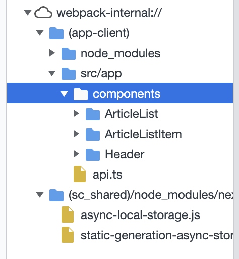
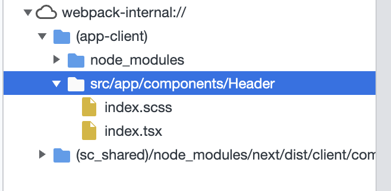

# React Server Components

[2023-01-31]

- 전통적인 Fetch -> Render 방식의 문제점
  - 부모 컴포넌트 P1 에서 필요한 데이터를 Fetch
    - Fetch 이후 부모 컴포넌트는 렌더링에 성공, 자식 컴포넌트 C1을 렌더링 하기 위한 데이터를 Fetch
      - Fetch 이후 자식 컴포넌트 C1은 렌더링에 성공, ... 반복
        - 결과적으로 React Component Tree를 모두 렌더링하기 위해 Waterfall Rendering Model이 발생한다.

위의 문제점을 개선하기 위해 GraphQL과 같은 솔루션으로 한번의 네트워크 라운드 트립에 특정 컴포넌트 트리를 렌더링 하기 위한 데이터를 모두 가져오는 대안을 선택할 수 있었다. 그러나 부모 컴포넌트 하위의 자식 컴포넌트의 독립성은 저해될 수 있다.

그렇다면 모든 프로젝트에 GraphQL 솔루션을 반드시 적용해야만 하는가?

- 사소한 프로젝트에도 반드시 GraphQL을 넣어야만 할까?
- GraphQL은 Waterfall Rendering 문제에 대한 하나의 기술이지 리액트 어플리케이션과 반드시 커플링되어야 하는 요소는 아니다.

생각을 달리 해보자.

클라이언트 사이드에서 네트워크 요청이 동반되는 컴포넌트를 렌더링을 할때 Waterfall 문제를 겪는다.

- 만약 서버에서 컴포넌트를 렌더링 한다음 클라이언트로 응답할 수 있다면?
  - 서버상에서만 실행 및 렌더링되고 클라이언트로 Hydration을 위한 스크립트를 전송해줄 필요가 없게 된다면?
    - 클라이언트로 응답하는 페이로드가 적어진다.
  - 서버에서 컴포넌트를 렌더링할때만 필요한 벤더 모듈이 있다면?
    - 클라이언트로 응답하는 번들 스크립트에 불필요한 벤더 모듈이 포함되지 않게되어 클라이언트로 응답하는 페이로드가 적어진다.
  - 서버상에서만 컴포넌트가 실행된다면 서버와 연결된 데이터베이스를 직접 호출 할 수도 있다. 이것은 상대적으로 긴 레이턴시가 발생하는 클라이언트에서 데이터베이스를 호출하는 것보다 짧은 지연시간을 갖는다. (이 부분은 개인적으로 Waterfall 이슈에 대한 개선 포인트이라고 생각하며 완전한 해결책은 아닌 것 같다.)

정리하면

- React Server Components 기술은 React SSR 기술과 서로 상호 보완적인 역할을 한다.
- React Server Components 를 통해 Server Only 컴포넌트를 사용하면 클라이언트 번들 자바스크립트에 포함되지 않는다.
- 상태와 상호작용이 필요하지 않은 컴포넌트는 Server Only 컴포넌트로 지정한다.
- 상태와 상호작용이 필요한 컴포넌트는 Client Only 컴포넌트로 지정한다.
- Server & Client 양쪽에서 모두 사용될 컴포넌트는 Shared 컴포넌트로 지정한다.

주관적인 의견은

- 검색엔진 최적화, 빠른 FCP, LCP가 필요없는 내부 솔루션은 여전히 CSR을 적용이 여전히 좋은 선택이다.
- 검색엔진 최적화, 빠른 FCP, LCP가 필요한 쇼핑몰, 콘텐츠 플랫폼, 모바일을 대응하는 솔루션은 SSR 적용을 고려할만 하다.
- React Server Components 가 SSR, CSR을 초월하는 만병통치약이 아니다. 그러나 SSR 환경에서 클라이언트로 전달되는 페이로드의 용량을 개선하는 부분, 네트워크 레이턴시를 단축시키는 부분은 주목할 만 하다.

React Server Components 기술은 Next.js 13 버전에서 적용되어 소개되고 있는 것으로 보인다.

잘 정제된 프레임워크를 통해 경험해보자.

[2023-02-01]

React Server Components, 앞으로는 RSC라고 하자. Nextjs 13 베타버전의 공식 문서를 참고하면 `app` 디렉토리 하위에 작성하는 컴포넌트는 프레임워크에 의해 기본적으로 Server Component 로 취급이 된다.

나는 간단한 블로그 어플리케이션을 만들어볼 것이며 기본적으로 모두 Client Component로 처리한다음 Server Component로 이전하는 작업을 진행해 볼 것이다. 이렇게 작업을 해보는 이유는 Client Component 하나씩 Server Component로 전환하면서

클라이언트로 전송되는 번들 스크립트 사이즈와 FCP, LCP가 어떻게 변화하는지 관찰하기가 용이할 것이라 판단했다.

```
- 블로그
    - 홈
    - 게시글 작성 페이지
    - 게시글 수정 페이지
    - 게시글 상세 페이지
```

[2023-02-04]

기본적인 블로그 구현을 마치고 홈 페이지에서 사용되는 컴포넌트를 client 에서 server only 컴포넌트로 이전했다.

- ArticleList.tsx
- ArticleListItem.tsx

먼저 `ArticleList`를 server only 컴포넌트로 변경해보자. 컴포넌트에 있는 `use client` 디렉티브를 제거한다. 이제 프레임워크는 이 컴포넌트를 server only 컴포넌트로 취급한다. 그러나 상태관리 훅이 server only 컴포넌트로 전환하는데에 문제가 된다. 클라이언트에서 Fetch 하여 리스트를 렌더링하는 로직을 제거한 다음, Server Component 에서는 함수 컴포넌트 선언을 async로 작성할 수 있기 때문에 Data Fetching에 대해서 별도의 상태관리 훅 없이 진행할 수 있다.

```tsx
// before
export default function ArticleList() {
  const [articles, setArticles] = useState([]);

  useEffect(() => {
    fetchArticles().then((articles) => {
      setArticles(articles);
    });
  });

  return articles.length > 0 ? (
    <div>
      {articles.map((article) => (
        <ArticleListItem key={article.id} {...article} />
      ))}
    </div>
  ) : null;
}
```

서버에서 Data Fetching의 완료를 기다린 후 리스트를 렌더링한 HTML을 응답한다.

```tsx
//after
export default async function ArticleList() {
  const articles = await fetchArticles();
  return articles.length > 0 ? (
    <div>
      {articles.map((article) => (
        <ArticleListItem key={article.id} {...article} />
      ))}
    </div>
  ) : null;
}
```

다음은 `ArticleListItem` 컴포넌트를 전환해보자. 마찬가지로 `use client` 디렉티브를 제거한다. 이 컴포넌트는 별도의 상태관리 훅이 없어서 server only 컴포넌트로 전환하기 알맞다. 추가로 timestamp 포맷을 위해 `dayjs` 모듈을 사용하고 있는 것을 확인할 수 있는데 이 전환을 통해 클라이언트로 전송되는 번들 스크립트 감소의 효과를 갖게된다.

```ts
// before
"use client";

import Link from "next/link";
import type { Article } from "@/app";
import "@/app/components/ArticleListItem/index.scss";
import dayjs from "dayjs";
import relateveTimePlugin from "dayjs/plugin/relativeTime";
import utcPlugin from "dayjs/plugin/utc";

dayjs.extend(utcPlugin);
dayjs.extend(relateveTimePlugin);

interface Props extends Omit<Article, "content"> {}

export default function ArticleListItem({ id, title, createdAt }: Props) {
  return (
    <div className="article-list-item">
      <h2 className="article-title">
        <Link className="article-title-link" href={`/article/read/${id}`}>
          {title}
        </Link>
      </h2>
      <div>
        <span>{dayjs(createdAt).utc().fromNow()}</span>
      </div>
    </div>
  );
}
```

```ts
// after
// "use client";
```

이번 작업으로 관찰해본 변화는 아래와 같다.

클라이언트에서 전송하는 요청의 개수와 트래픽 용량이 줄어든다.

| before                                                                  | after                                                                 |
| ----------------------------------------------------------------------- | --------------------------------------------------------------------- |
|  |  |

클라이언트에서 `ArticleList`, `ArticleListItem` 컴포넌트 스크립트를 불러올 필요가 없다. 서버에서 HTML로 렌더링하고 끝이다.

| before                                                                | after                                                               |
| --------------------------------------------------------------------- | ------------------------------------------------------------------- |
|  |  |

`ArticleListItem` 컴포넌트에서 사용하던 `dayjs` 모듈은 서버상에서만 필요한 모듈이 되었으므로 클라이언트에서 로드하지 않는다.

| before                                                                | after                                                               |
| --------------------------------------------------------------------- | ------------------------------------------------------------------- |
|  |  |

성능 지표의 전과 후를 비교할 수 있다.

| before                                                                        | after                                                                       |
| ----------------------------------------------------------------------------- | --------------------------------------------------------------------------- |
|  |  |

### References

- https://ko.reactjs.org/blog/2020/12/21/data-fetching-with-react-server-components.html
- https://nextjs.org/docs/advanced-features/react-18/server-components
- https://beta.nextjs.org/docs/getting-started
- https://tech.kakaopay.com/post/react-server-components/
- https://yceffort.kr/2022/01/how-react-server-components-work
- https://patterns-dev-kr.github.io/rendering-patterns/react-server-components/
